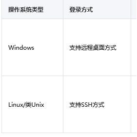
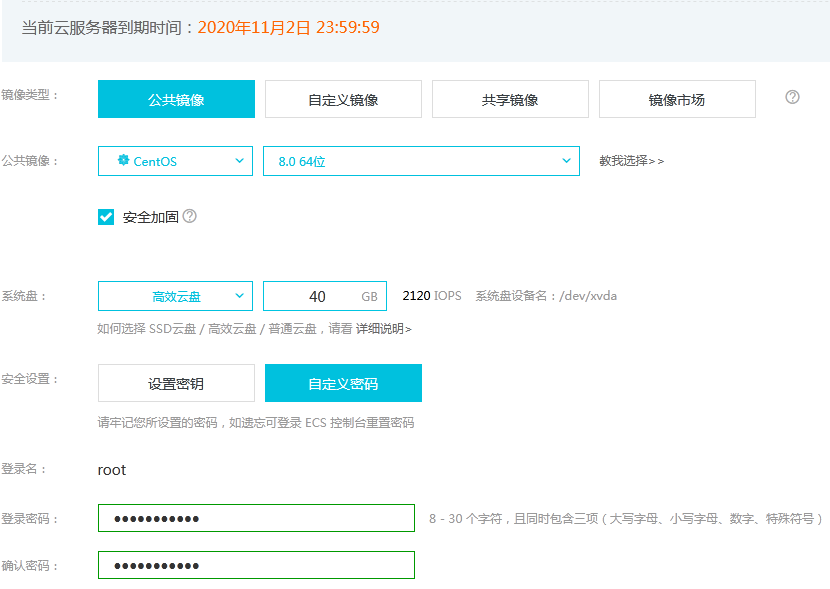
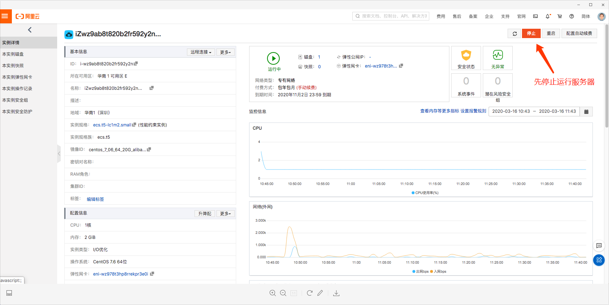
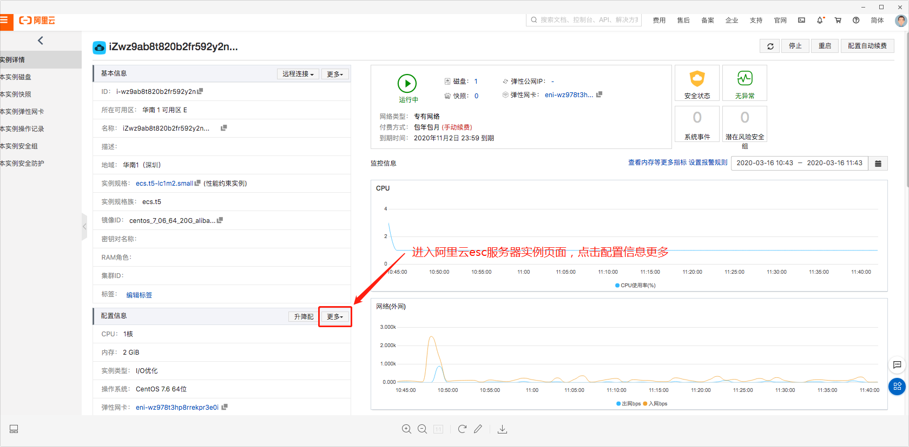
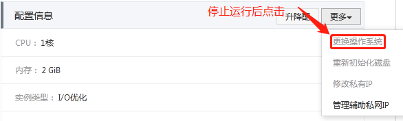
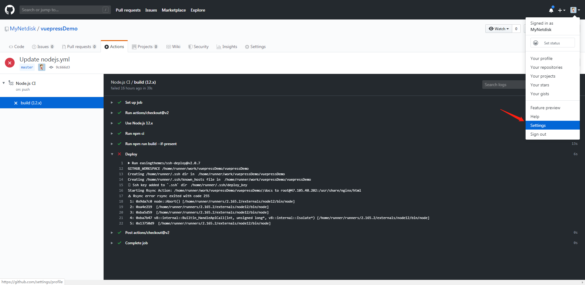
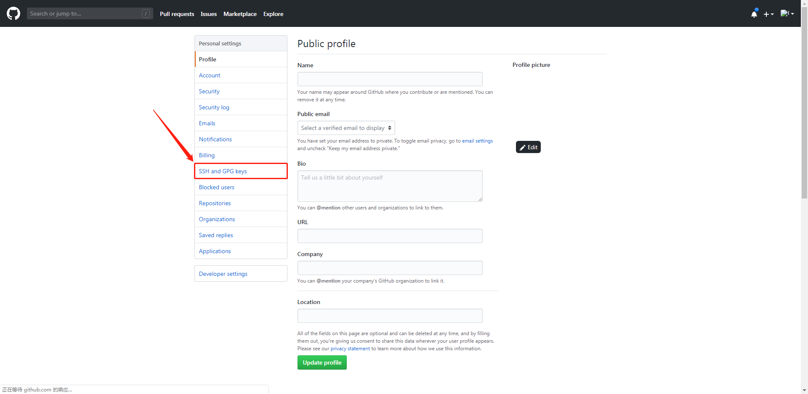
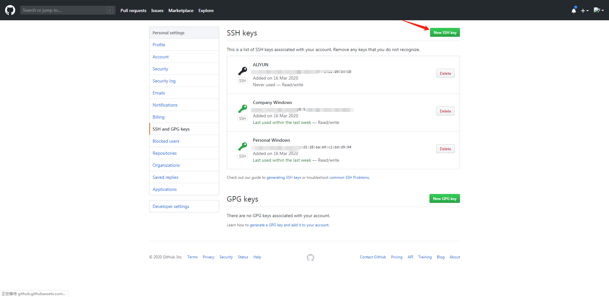
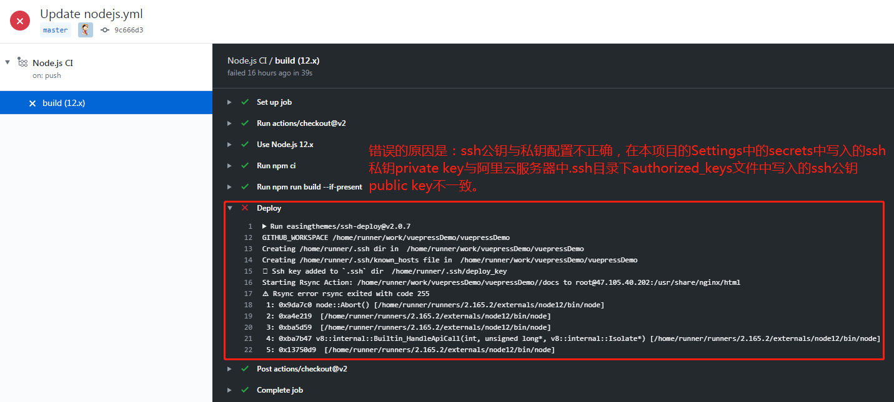
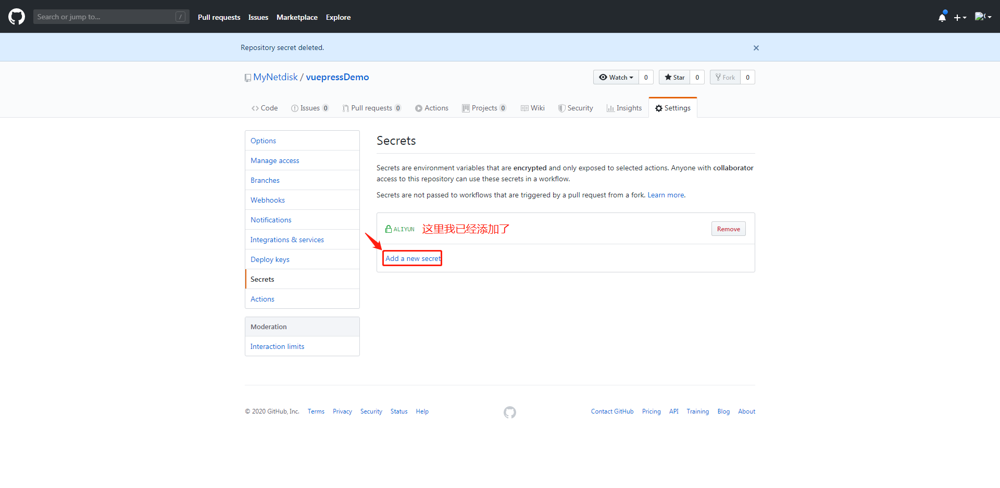

## 使用github action实现个人vuepress博客自动部署到阿里云服务器
::: tip PS:
当github仓库发生push操作时，action会通过ssh(配置公钥与私钥与阿里云服务器免密连接)传送到nginx服务器的静态资源目录下。
:::
### 1、写在前面的
#### 因为在我购买阿里云服务器时选择的系统配置是windows server 2019版本的，所以不能通过ssh来实现阿里云服务器与本地电脑实现ssh免密连接，进而也不能实现github action与阿里云服务器的免密连接。


#### 最后的解决方案是更改阿里云服务器的系统配置。

#### 更改服务器系统配置的具体操作如下： 




### 2、正文开始
#### 从安装nginx服务器到自动部署主要参考文章，链接如下：
#### 阿里云服务器-自动部署一键部署（哔哩哔哩视频）：https://www.bilibili.com/video/av91796463
#### Centos 7下安装配置Nginx：https://yq.aliyun.com/articles/699966
#### GitHub Actions 入门教程：http://www.ruanyifeng.com/blog/2019/09/getting-started-with-github-actions.html

#### ssh key 与 github 配置（实现本地电脑/阿里云服务器与github的免密通信）：https://shanyue.tech/op/ssh-setting.html#permission-denied-publickey

### 生成一个新的 ssh key：

#### 将生成的ssh公钥public key添加到github中：



### 3、遇到的主要问题

#### 添加阿里云服务器.ssh目录下的ssh私钥private key到github当前项目的setting》secrets中：

#### 将公钥写入authorized_keys文件中的命令是：
```
[root@iZm5e8dv3a3meqZ .ssh]# cat id_rsa.pub >> ~/.ssh/authorized_keys
```
#### 打开authorized_keys文件中的命令是：
```
vim authorized_keys
```
#### 退出authorized_keys文件中的命令是：
```
:wq
```
#### 删除文件命令：rm -f authorized_keys
#### 参考：Linux学习笔记--rm命令(删除文件或目录)
#### https://blog.csdn.net/daidaineteasy/article/details/50663101

### 4、我的github action(nodejs)配置如下：
```
# This workflow will do a clean install of node dependencies, build the source code and run tests across different versions of node
# For more information see: https://help.github.com/actions/language-and-framework-guides/using-nodejs-with-github-actions

name: Node.js CI

on:
  push:
    branches: [ master ]
  pull_request:
    branches: [ master ]

jobs:
  build:

    runs-on: ubuntu-latest

    strategy:
      matrix:
        node-version: [12.x]

    steps:
    - uses: actions/checkout@v2
    - name: Use Node.js ${{ matrix.node-version }}
      uses: actions/setup-node@v1
      with:
        node-version: ${{ matrix.node-version }}
    - run: npm ci
    - run: npm run build --if-present
      env:
        CI: true
    # Deploy
    - name: Deploy
      uses: easingthemes/ssh-deploy@v2.0.7
      env:
        SSH_PRIVATE_KEY: ${{ secrets.ALIYUN }}
        ARGS: "-rltgoDzvO --delete"
        SOURCE: "./docs/.vuepress/dist/"
        REMOTE_HOST: "你的阿里云公网ip"
        REMOTE_USER: "用户名：如root"
        TARGET: "web服务器静态文件托管文件地址如：/usr/share/nginx"
```

### 5、写在后面的
#### 萌新报道，写的不好的地方请多包涵。如果有更好的建议请写到评论下方。感激不尽！希望对您有所帮助！！！