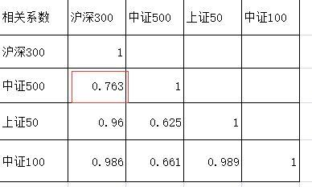

::: tip
原文链接：https://zhuanlan.zhihu.com/p/20780784
:::
有个可爱的妹纸跟我说，她为了分散风险，把上证50、沪深300、中证500、中证100都买了。分散风险是对的，但在我看来还是有点不足。看完这篇文章再告诉你。

为什么购买指数基金：

书生经常对没有投资经验的投资者说，不知道买什么基金，就买指数基金吧。那是因为，在指数上涨时，大概50%的股票基金都跑不赢指数基金，只有少数优秀基金能获得超额收益。其实股票也是这样，跑不赢指数的情况经常发生。

按跟踪的指数不同，指数基金分类：

大盘指数型基金

沪深300：这是个跨市场指数，是从上海和深圳证券市场中选取了300只规模大、流动性好的300只股票作为样本；覆盖了沪深市场60%左右的市值，具有良好的市场代表性，是个大中盘指数。
中证500：扣除沪深300指数样本、按日均总市值高低排名选取前500名股票作为样本，综合反映沪深证券市场内小市值公司的整体状况；是第一只综合体现沪深两市小市值企业的指数，是个小盘指数。
上证50：挑选上海证券市场规模大、流动性好的最具代表性的50只股票组成样本股，综合反映上海证券市场最具市场影响力的一批龙头企业的整体状况；是优质蓝筹股的突出代表，不是期望分享高成长收益投资者的最佳选择，是超大盘指数。
中证100：从沪深300指数样本股中挑选规模最大的100只股票组成样本股，以综合反映沪深证券市场中最具市场影响力的一批大市值公司的整体状况，是大中盘指数。
行业指数型基金：以具体行业为跟踪目标，通常有医疗、证券银行等。

平时不少读者都在问该怎么选择具体的指数基金。其实被动型指数基金没什么高深的，各个基金公司都差不多，大多数也都能很好的跟踪指数，最主要的还是费率的差别。比如天弘中证500指数基金（000962）就属于同类基金比较低的费率档次。

关于具体的指数基金选择方法，后面文章我们再详细说。

### 投资策略：

1.上涨趋势时，投资大盘指数型基金，可以简单获得稳定收益。

2.长期下跌或震荡行情，投资行业指数基金更好。往往在熊市，医药、白酒行业能走出独立行情，而且更抗跌。

3.中证50这样的超大盘指数，样本股都是一些流通盘大、市值高的企业，短期内很难有很大发展。所以，只有出现大幅下跌后，才适合投资中证50这样的超大盘指数。

我们在看下这些大盘指数基金之间的相关系数，相关系数越大，走势越趋同。

这里回答文章开头的问题，我们投资多个指数基金是为了分散风险，并不是越多越好。如果买的指数走势趋同，同涨同跌，也就失去了意义。

书生云：建议组合投资的小伙伴，可以选择沪深300和中证500的组合。沪深300相对于中证50这样超大盘更好点，同时这两个指数的相关性也不是很大。